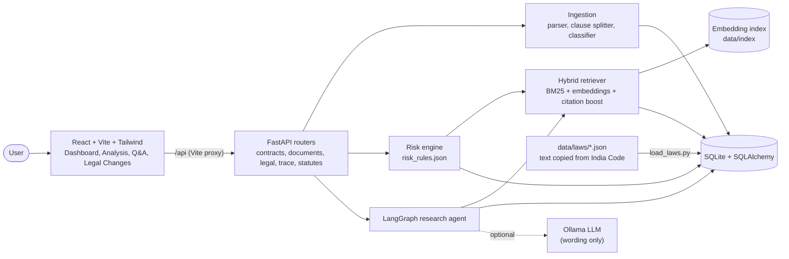
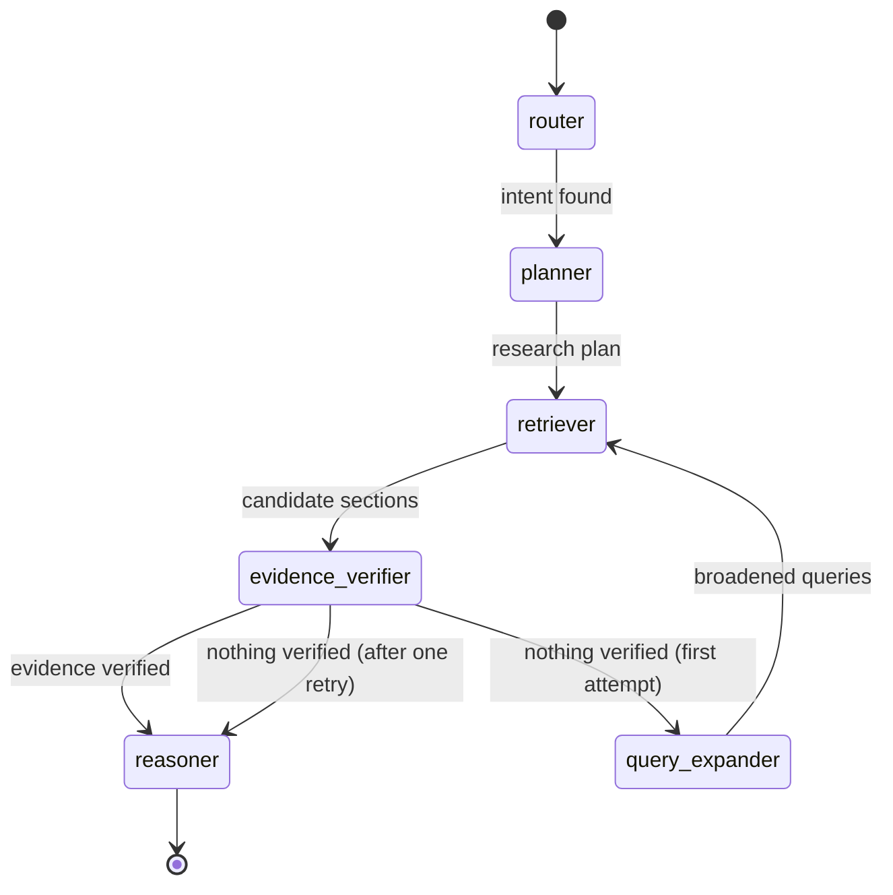
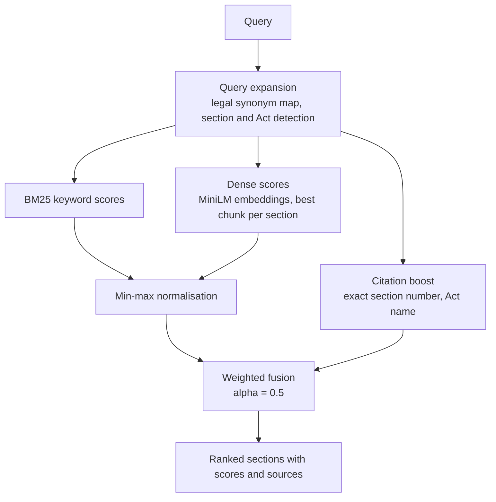
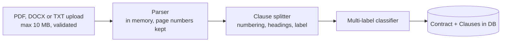
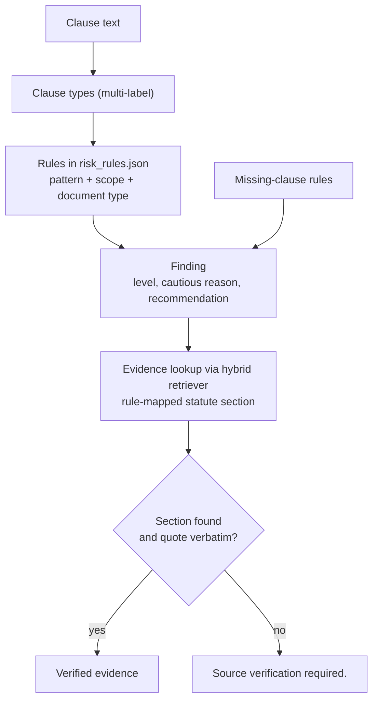
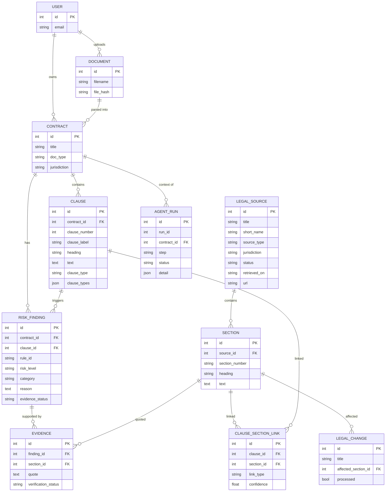
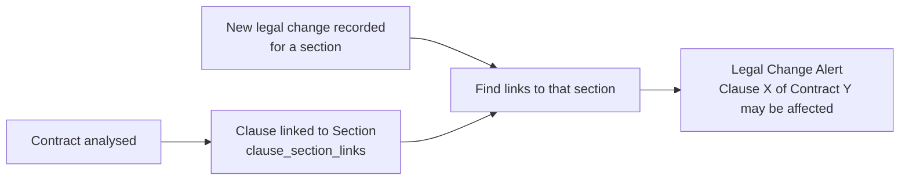
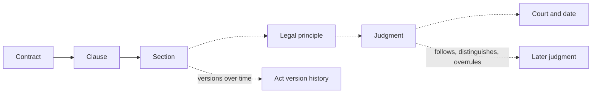

# NyayaAI: Architecture

All diagrams are [Mermaid](https://mermaid.js.org/). They render in GitHub, VS Code (Markdown Preview Mermaid Support extension) and https://mermaid.live. What is **implemented** is shown with solid lines; **planned** work is shown dashed.

## 1. System architecture

**Principle:** the LLM is never the authority. Statute text comes only from the database; the optional LLM may only rephrase verified evidence.

## 2. Agent workflow (LangGraph state machine)

| Node | What it does |
|---|---|
| router | Neutralises instruction-like text, picks the intent: `legal_qa`, `clause_explain` or `contract_risk_audit` |
| planner | Builds a research plan (search steps, direct section lookups); for contracts it derives steps from the rule engine's findings |
| retriever | Runs the plan with at most 2 worker threads (RAM limit) |
| evidence_verifier | Checks the section exists, the quote is verbatim from stored text, and the section is relevant |
| query_expander | One retry with broadened queries if nothing was verified |
| reasoner | Builds evidence objects and the answer (template, or LLM with strict output checks); otherwise says "Source verification required." |

Every node appends `{step, status, detail, timestamp}` to the trace, which is saved in `agent_runs` and shown in the UI. This is an audit trail, not hidden reasoning.

## 3. Hybrid retrieval pipeline

## 4. Ingestion pipeline

Uploads are parsed from memory and never written to disk; only a SHA-256 hash is kept.

## 5. Risk analysis flow

Restraint clauses get a **scope check**: `post_employment`, `during_only` or `unclear`. Only post-employment restraints get the highest priority.

## 6. Database ER diagram

`clause_section_links` is the first building block of the Legal Impact Graph: it is what lets a legal change find the clauses it may affect.

## 7. Legal change impact (implemented, simple version)

## 8. Planned: Legal Impact Graph and judicial authority (future work)

Dashed items are **not implemented**. Today the system links Contract, Clause and Section only.

## 9. Implemented vs planned

| Capability | Status |
|---|---|
| Clause extraction and multi-label classification | Implemented |
| Hybrid statute retrieval (BM25 + dense) | Implemented |
| Rule-based risk engine with verbatim evidence | Implemented |
| LangGraph research agent with trace | Implemented |
| Prompt-injection guard, cautious wording checks | Implemented |
| Legal change to affected clause alert (simple) | Implemented (mock changes) |
| Judicial hierarchy and case relationships | Planned |
| Temporal versioning of laws | Planned |
| Full Legal Impact Graph | Planned |
| Semantic contract comparison | Planned |
| Multi-jurisdiction adapters | Planned |
